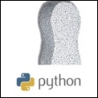

# Pubmex
(tested on macOS and Linux)



[](https://github.com/mmagnus/pubmex/releases)
 <a href="https://pypi.org/project/pubmex"></a>

<p align="center">
  
</p>
 	
`pubmex.py` is a script to get a fancy paper title based on given DOI or PMID (can be also combined with macOS Finder)

Format of the title:

	a first author . a last author - (title("dotted") or your customed title) . PMID . journal . year . pdf
	e.g.
	  Kelley.Scott.The.evolution.biology.shift.towards.engineering.prediction-generating.tools.away.traditional.research.practice.EMBORep.2008.pdf


Nowadays, it’s not a big issue, with all Mendeley and other tools, however...

I don’t want to put any PDF file collected on the way into my library, because then it gets super big (and then it’s hard to sync it for example with Dropbox). So now I can keep these PDF files into pdf-icebox and re-name them niecely automatically:

```
$ ls
Hnisz.Sharp.Phase.Separation.Model.Transcriptional.Control.Cell.2017.pdf
Sharp.Hockfield.Convergence.The.future.health.Science.2017.pdf
```

Usage:

```
$ pubmex.py sharp2017.pdf
Sharp.Hockfield.Convergence.The.future.health.Science.2017.pdf
mv sharp2017.pdf --> ./Sharp.Hockfield.Convergence.The.future.health.Science.2017.pdf

$ pubmex.py Query.Konarska.pdf
mv Query.Konarska.pdf --> ./Smith.Konarska."Nought.may.endure.but.mutability".spliceosome.dynamics.regulation.splicing.MolCell.2008.pdf
    
$ pubmex.py eabc9191.full.pdf
mv  eabc9191.full.pdf --> ./Balas.Johnson.Establishing.RNA-RNA.interactions.remodels.lncRNA.structure.promotes.PRC2.activity.SciAdv.2021.pdf
```

# Install

pubmex.py is depended on: 

- biopython (http://biopython.org/wiki/Biopython)
- pdftotext (http://linux.die.net/man/1/pdftotext)

you can install them with: 

    # Ubuntu (Debian-based system)
    apt-get install xclip python-biopython pdftotext
    # macOS
    brew install poppler biopython # or "sudo port install poppler biopython"
    # or biopython with conda, `conda install -c conda-forge biopython`

and then:

    pip install pubmex
    
or get pubmex (the latest, version from this Github repository)

    pip install -e git+http://github.com/mmagnus/pubmex.git#egg=pubmex

# History

- 1.4 Add osx-automator
- 1.3 Fixed #4 #5
- 1.2 Fixed #2
- 1.1 Simplify input, `pubmex.py *.pdf`
- 1.0 With recent bugfixes 2021
- 0.3 OSX installation
- 0.2 Small changes
- 0.1 Init version in 2010! :-)

# Alternatives

- https://github.com/MicheleCotrufo/pdf-renamer
